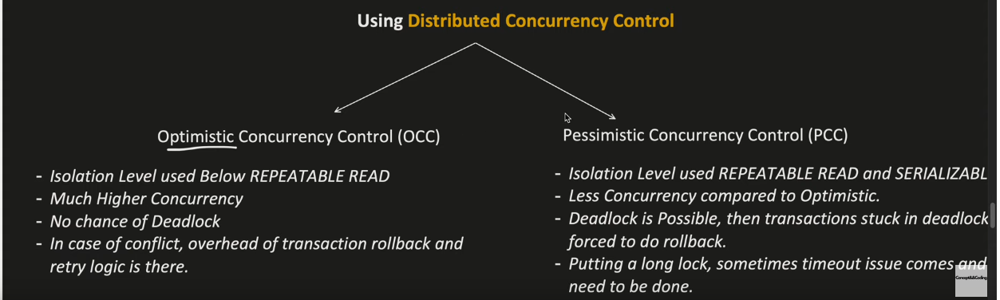

https://lucid.app/lucidchart/deefdde8-04dc-48bc-80cf-ac5ae84839af/edit?invitationId=inv_ceb2d465-a29a-4105-a2df-67671c059900&page=HWEp-vi-RSFO#

# Introduction
- Low Level Design is to design at the component level.  It includes creating classes and methods.
- This is how classes and interfaces are represented.

- Abstract Class vs Interface:

# OOPS Concepts
- objects
- classes
- Inheritance
- Encapsulation
- Abstraction
- Polymorphism: runtime, compile time, method overloading, method overriding

# SOLID Principles

# Relationship between classes
- Association:
  - This defines a **call** relationship.  For example, if A has an association with B, then A can call B (but B may or may not call A).
  - Types:
    - Bidirectional: 
      - Class A can call B and vice versa.  
      - For example, Guide class can call Hiker class and vice versa.
      - It is represented using a line without any arrows
    - Unidirectional: 
      - Class A can call B but B cannot call A.  
      - For example, Guide class can call Trail class, but Trail class cannot call Guide class. 
      - It is denoted using a line with an arrow from the caller to the callee class.
      - 
  - Multiplicity:
    - It denotes the number of instances of a class that can be associated with a different class.
    - We write the number of instances at the arrow end-points.
    - How to write a number:
      - n denotes n number of instances
      - x..y denotes a minimum of x and a maximum of y instances.  Ex: 1..5
      - * denotes any number of instances
    - 
  - Sometimes the name of th relationship is written in the arrow to denote how a class is associated with other classes.  For example, A Guide guides a hiker, and follows a trail.
    - 
- Aggregation:
  - Aggregation and Composition comes under **has-a** relationship.
  - Class A **has-a** class B instance, but a class B instance can exist without class A.  For example, a HikeEvent **has-a** Trail, but a Trail can exist without a HikeEvent.
  - It is denoted using a diamond arrow.
  - If a class can be a part of multiple classes, then it cannot be a composition relationship.  It has to be aggregation.  Ex: a Trail class can belong to a HikingEvent, a Guide, a Hiker etc.
- Composition:
  - A class B cannot exist without A.  For example, a License cannot exist without a Guide.  A Guide **has-a** License.
  - In this case, we should delete class B whenever we delete class A.
  - Therefore, sometimes it is also called **part-of** relationship.
  - It is denoted using a diamond arrow, but the diamond is colored.
- Inheritance:
  - **is-a** relationship.
  - 
  - Abstract class or Interface: A **implements** B.  It is denoted using a dotted line.
    - To denote an interface just use the same class box as earlier, and mention the class name in italics.

# Design Patterns
- Strategy:
  - It is used when a class "has-a" another class and that class might change behaviour based on certain conditions.
  - For example, A Order class might have to pay() to complete the order.
    - Now, if we have different options of payment like Gpay, phonepay, etc. then we might have to subclass multiple Order classes like GpayOrder, PhonePayOrder etc. which will unnecessarily duplicate some of the common code of Order class.  Also, it breaks the DRY principle, and we might have to change multiple classes (GpayOrder, PhonePayOrder etc.) if we have to make just one change (breaks O prinicple of SOLID).
    - Solution: Order "has-a" interface Pay with pay() and Gpay, PhonePay etc. implements this interface.
      - Order is injected either Gpay or PhonePay and Order simply calls pay() provided by the interface.
- Singleton:
  - It is used when we want only one instance of a class.
  - Uses: to limit access to a heavily used resource like DB, logging, caching data, threadpool etc.
- Factory
  - It is used to create classes of similar family.  For example, different shapes like circle, triangle, rectangle can have the same function draw().
  - If we want to create these classes based on if-else conditions then, it will break the Open-Closed principle because to introduce a new class of family shape, we will have to modify the client class with a new if condition and the if-else nest might get confusing if there are 200 classes of that type for example.
  - Solution:
    - Create a base Factory class from which different Shape creator factory classes can implement.  These different shape creator factory classes are responsible to create different shape objects.
    - Create a base Shape class which functions common to all shapes.  Now, different shapes inherit from this class.
    - Now, from the calling client class, get the correct shape class using the correct factory-creator and use the functions from this.
- AbstractFactory
- Observer
  - It is used when multiple clients need to be updated in reaction to a state change in a class.  For example, if it starts raining then all clients need to be updated that their food delivery might be delayed.
  - All the observer client classes might subscribe and unsubscribe to the class with the state, and they need to implement an interface with notify()
- Decorator
  - It is used to stop explosion of classes.  For example, for pizza we can have a number of basePizzas (like margerita, veggie, onionPizza etc.) and number of toppings (like extrachesse, extraOnions, extraGarlic etc.).
  - Now if we want to provide clients with flexible selections then we need to create exponential number of classes:
    - with 0 extra topping - margherita, veggie etc.
    - with 1 extra topping - margheritaExtraCheese, margheritaExtraOnion, VeggieExtraCheese, VeggieExtraOnion etc.
    - with 2 extra toppings - margheritaExtraCheeeseExtraOnion, margheritaExtraCheeeseExtraGarlic, margheritaExtraGarlicExtraOnion, ...
    - Also if a new base pizza or topping is introduced we will have to add a lot of new classes.
  - Decorator helps with this problem by:
    - basePizza abstract class, from which concrete basePizza like Margherita inherits
    - toppingDecorator which is-a (inheritance) and has-a (composition) basePizza at the same time.
    - The is-a relationship forces the decorator to implement the ingredients() and pay() method for example.
- Chain Of Responsibility:
  - Problem it solves: A request comes in, and tried with level1 support first, which if it cannot handle then is sent to level2 support which if it cannot solve is sent to level3 support, and so on.
  - In this case, instead of the client implementing the if-else conditions to escalate the request, the client just sends the request to the first handler which takes care of calling the appropriate handler.  Here handlers are chained as a list.
  - Benefit: If we want to add a new handler, then we do not need to change the client.  The chain of handlers handle it.
  - A handler interface is created from which concrete handlers inherit.  2 methods are required to be implemented: execute(), next_handler().  In execute(), if the current handler can't solve the request, then in the else condition it sends the request to the next_handler.
  - Example usage: ATM, GUI, Logging system, etc.
- Builder
- Adapter
- Facade

# Other Concepts
- Concurrency:
  - use synchronized for the critical section
  - In python it is done using lock.acquire() and lock.release(), but use of threads is a bad idea in Python for CPU intensive tasks.  In Python it is better to use multiprocessing which won't have critical section
  - Using synchronized block() might not work in a distributed system because multiple nodes might be accessing the same seat.
  - For distributed systems we need to use **Distributed Concurrency Control** (DCC).
  - DCC has 2 options: 
    - Optimistic Concurrency Control
    - Pessimistic Concurrency Control
    - 
      - &copyright; Shrayansh
  - Types of DB Locks:
    - Shared Lock: multiple transactions can take a shared lock -- usually used in reads
    - Exclusive Lock: only one transaction can take an exclusive lock.  For example, only one write transaction takes an exclusive lock in which case a read (shared) lock cannot read before the exclusive lock finishes (to make sure it does not read intermediate write of exclusive lock which might not commit in the end and then our read lock would have just read the data that was not comitted after all). 
      - To get an exclusive lock we must wait for all the other shared/exclusive locks to finish.
  - Isolation Levels: the I in ACID
    - Isolation Levels tell us how much concurrency is allowed in our system
    - More details: https://github.com/2kunal6/system_design/blob/main/Data_Intensive_Applications_Martin_Kleppman.md
- Sequence Diagrams
- Activity Diagrams
- Test Cases
- Multi-Threading: how is it implemented in Singleton Pattern?

# Examples
- Hotel Management System
- Car Parking System
- Elevator Management
- 2 player games like Chess, Tic Tac Toe
- Ticket Booking System
- ATM