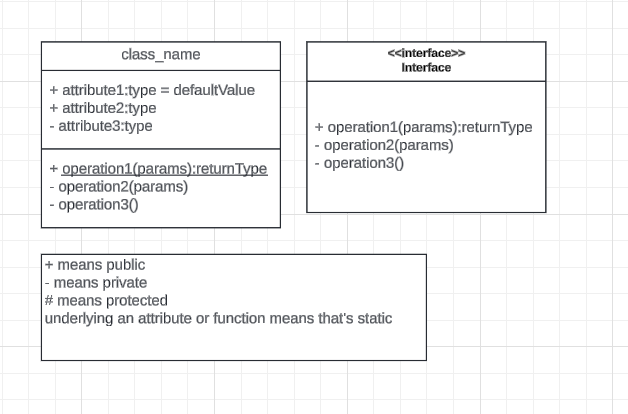
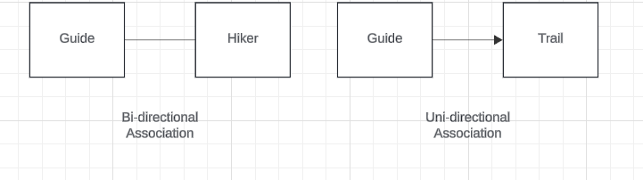
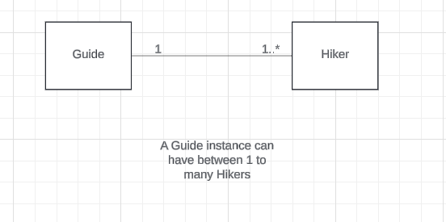
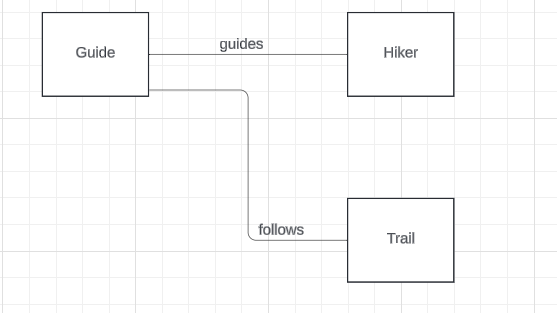
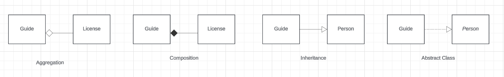

https://lucid.app/lucidchart/deefdde8-04dc-48bc-80cf-ac5ae84839af/edit?invitationId=inv_ceb2d465-a29a-4105-a2df-67671c059900&page=HWEp-vi-RSFO#

# Introduction
- Low Level Design is to design at the component level.  It includes creating classes and methods.
- This is how classes and interfaces are represented.

- Abstract Class vs Interface:

# OOPS Concepts
- objects
- classes
- Inheritance
- Encapsulation
- Abstraction
- Polymorphism: runtime, compile time, method overloading, method overriding

# SOLID Principles

# Relationship between classes
- Association:
  - This defines a **call** relationship.  For example, if A has an association with B, then A can call B (but B may or may not call A).
  - Types:
    - Bidirectional: 
      - Class A can call B and vice versa.  
      - For example, Guide class can call Hiker class and vice versa.
      - It is represented using a line without any arrows
    - Unidirectional: 
      - Class A can call B but B cannot call A.  
      - For example, Guide class can call Trail class, but Trail class cannot call Guide class. 
      - It is denoted using a line with an arrow from the caller to the callee class.
      - 
  - Multiplicity:
    - It denotes the number of instances of a class that can be associated with a different class.
    - We write the number of instances at the arrow end-points.
    - How to write a number:
      - n denotes n number of instances
      - x..y denotes a minimum of x and a maximum of y instances.  Ex: 1..5
      - * denotes any number of instances
    - 
  - Sometimes the name of th relationship is written in the arrow to denote how a class is associated with other classes.  For example, A Guide guides a hiker, and follows a trail.
    - 
- Aggregation:
  - Aggregation and Composition comes under **has-a** relationship.
  - Class A **has-a** class B instance, but a class B instance can exist without class A.  For example, a HikeEvent **has-a** Trail, but a Trail can exist without a HikeEvent.
  - It is denoted using a diamond arrow.
  - If a class can be a part of multiple classes, then it cannot be a composition relationship.  It has to be aggregation.  Ex: a Trail class can belong to a HikingEvent, a Guide, a Hiker etc.
- Composition:
  - A class B cannot exist without A.  For example, a License cannot exist without a Guide.  A Guide **has-a** License.
  - In this case, we should delete class B whenever we delete class A.
  - Therefore, sometimes it is also called **part-of** relationship.
  - It is denoted using a diamond arrow, but the diamond is colored.
- Inheritance:
  - **is-a** relationship.
  - 
  - Abstract class or Interface: A **implements** B.  It is denoted using a dotted line.
    - To denote an interface just use the same class box as earlier, and mention the class name in italics.

# Design Patterns
- Factory
- AbstractFactory
- Singleton
- Observer
- Builder
- Decorator
- Adapter
- Strategy
- Facade

# Other Concepts
- Sequence Diagrams
- Activity Diagrams
- Test Cases
- Multi-Threading: how is it implemented in Singleton Pattern?

# Examples
- Hotel Management System
- Car Parking System
- Elevator Management
- 2 player games like Chess, Tic Tac Toe
- Ticket Booking System
- ATM